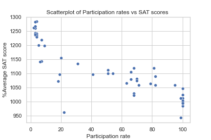

### How to increase ACT and SAT participation rates among high school students in Virginia

## Problem Statement 
ACT participation rates in Virginia are 30% lower than the national average while SAT participates rates are only 10% higher than the national average.

## Overview

This projects analyses why participation rates are not maximised in the state of Virginia and suggests a few key recommendations to try and increase them. These recommendations are appropriate for the Education department in Virginia. Although, the data analysed is from Virginia, it is likely that the recommendations can be applied for many states across the US. 

Recommendations: 

- Make all students ready for the SAT 
     -- Through free online resources and teaching SAT and ACT in school time  
    
- Make the SAT more affordable
     -- Fee waivers for students who come from low income families 
   
- Make the SAT mandatory 
     -- To give all students the chance to do well on the test 
 
- Participation rates statistics have to be looked at in conjunction with other statistics.
     -- E.g. look at the number of students who go onto successfully graduate College. 
 
## Data Analysis
### Why are participation rates low?
#### 1) Student Ability
This graph suggests that those who know they won't do well on the test will not take it.

#### 2) Cost
Students from higher income families tned to perform better. Additionally, it cost approximately $65 to take the tests.

# Data

Data containing each States Participation rate and test score.

2017 SAT Scores (https://git.generalassemb.ly/DSIR-907/project-1/blob/master/data/sat_2017.csv) \
2017 ACT Scores (https://git.generalassemb.ly/DSIR-907/project-1/blob/master/data/act_2017.csv) \
2018 SAT Scores (https://git.generalassemb.ly/DSIR-907/project-1/blob/master/data/sat_2018.csv) \
2018 ACT Scores (https://git.generalassemb.ly/DSIR-907/project-1/blob/master/data/act_2018.csv) \
2019 SAT Scores (https://git.generalassemb.ly/DSIR-907/project-1/blob/master/data/sat_2019.csv) \
2019 ACT Scores (https://git.generalassemb.ly/DSIR-907/project-1/blob/master/data/act_2019.csv) \
